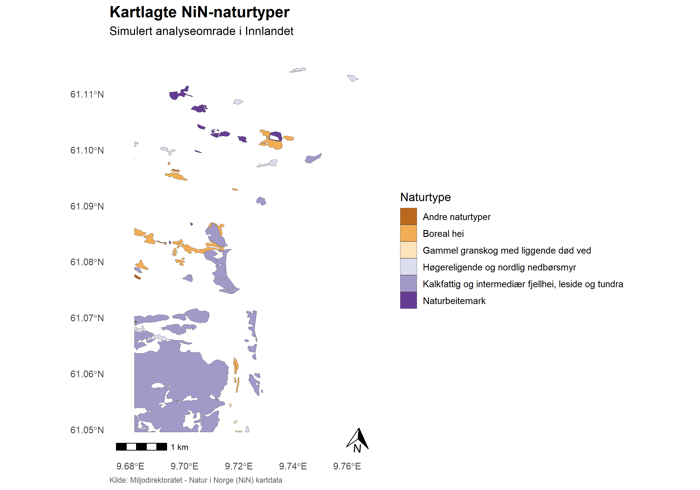

# NiN-analysis Innlandet

A GIS portfolio project demonstrating a basic spatial analysis workflow in R using mapped NiN (Nature in Norway) nature type data from Innlandet county, Norway.

## Project Overview

This project was set up as a way to further develop GIS and spatial analysis skills following a master's degree in bioscience at the University of Oslo. The analysis focuses on working with real ecological spatial data using reproducible workflows in R.

The project demonstrates:

- Importing and working with ESRI geodatabases ( `.gdb`)

- Handling spatial vector data using the `sf` package

- Inspecting coordinate reference systems (CRS)

- Creating and manipulating polygon geometries

- Performing spatial intersection analysis

- Calculating area statistics for mapped NiN nature types

- Creating publication-style maps using `ggplot2` and `ggspatial`

## Study area

A simulated 10km $\times$ 10km planning area was generated around the center of the NiN dataset extent in Innlandet county, Norway.

## Data source

The spatial dataset was downloaded from Miljødirektoratet and imported as an ESRI geodatabase (EPSG:25833).

Because the original dataset is relatively large, the raw spatial data are not included directly in this repository.

## Main findings

- Mapped NiN nature type polygons covered approximately **414 hectares**, corresponding to about **4.1%** of the total planning area.

- A small number of nature types strongly dominated the mapped area.

- The four largest mapped nature types together accounted for approximately **99.4%** of the mapped nature type coverage.

## Output



## Repository structure

``` text
nin-analysis-innlandet/
│
├── .gitignore
├── LICENSE
├── README.md
├── analysis.qmd
├── figures/
│   └── portfolio_map_clean.png
└── scripts/
```

## Tools and packages

- R

- Quarto

- sf

- dplyr

- ggplot2

- ggspatial

## Author

Øystein Sporild Myran

Master's degree in Bioscience, University of Oslo
